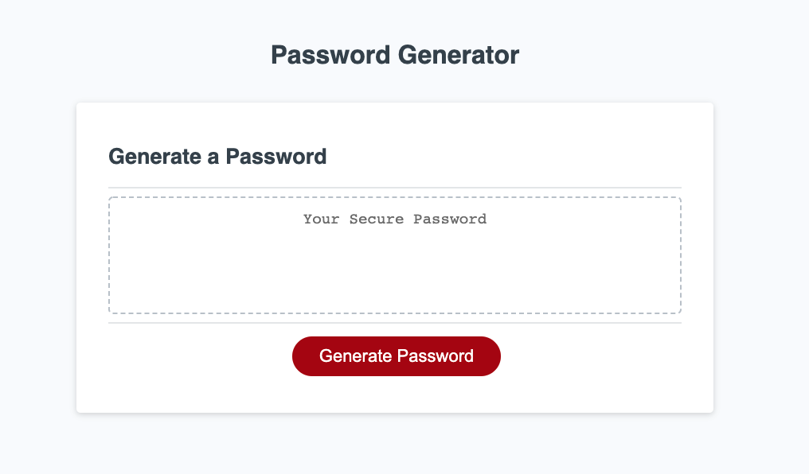

# randomPassword

## Introduction

A customer is requesting a password generator that will give the user an option of the number of characters and the type of characters that will be included. The user will be able to specify whether they would like the password to include capital letters, lowercase letters, numbers, and/or special characters. Once the choices are made a random password will be generated and shared with the user in the form of an alert.

## Running the code

The code uses a variety of arrays and objects to choose the random characters of the password. The user must choose between 8 and 128 characters and is prompted to do so. The user has a choice of the type of characters that are included. If the user chooses not to include a type of character, those characters will not be choices in the random pull.

### Random pull
The object "allCharacters" was created to include the different types of characters as properties and values. For example one object pair is numbers:1,2,3,4,5,6,7,8,9,0 . When the user chooses to include a type of character, that object pair is added to a separate object, pass{}. If the user chooses  to exclude a character it will not be added into the pass object. The code will then randomly choose from the properties in pass{} and then randomly chose a value from that chosen property. This will be repeated for the number of characters requested by the user. Upon completion the user will receive an alert with the password.

## Contributions
The HTML and CSS files were provided by Rutgers University Bootcamp staff and the JavaScript file was created by me.